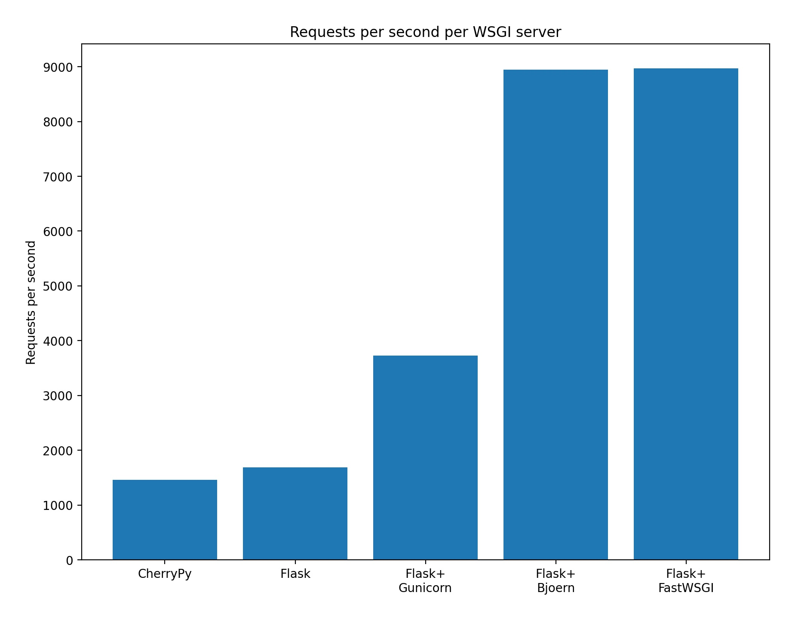
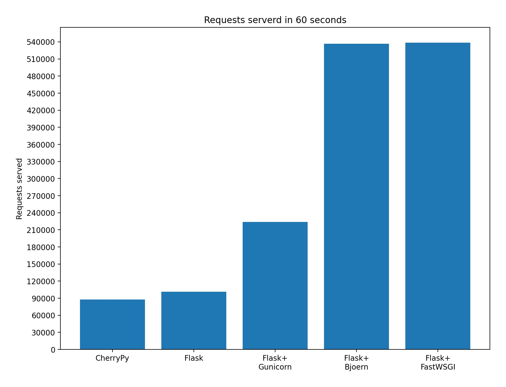

# Performance Benchmarks

## Flask based benchmarks

A set of "Hello World" benchmarks comparing FastWSGI's performance to other popular WSGI servers.

All benchmarks were performed with [wrk](https://github.com/wg/wrk).

- 8 threads
- 100 concurrent connections
- 60 second load duration

```bash
wrk -t8 -c100 -d60 http://localhost:5000 --latency
```

To see detailed results for each WSGI server, see the [results](./results) folder.

If you would like to reproduce these benchmarks on your own system you can clone this repo and run:

Note: You will need to have [wrk](https://github.com/wg/wrk) installed in order to run the benchmarks yourself.

```
cd performance_benchmarks/
./benchmark_all.sh
```

### Requests per second




### Requests served in 60 seconds

